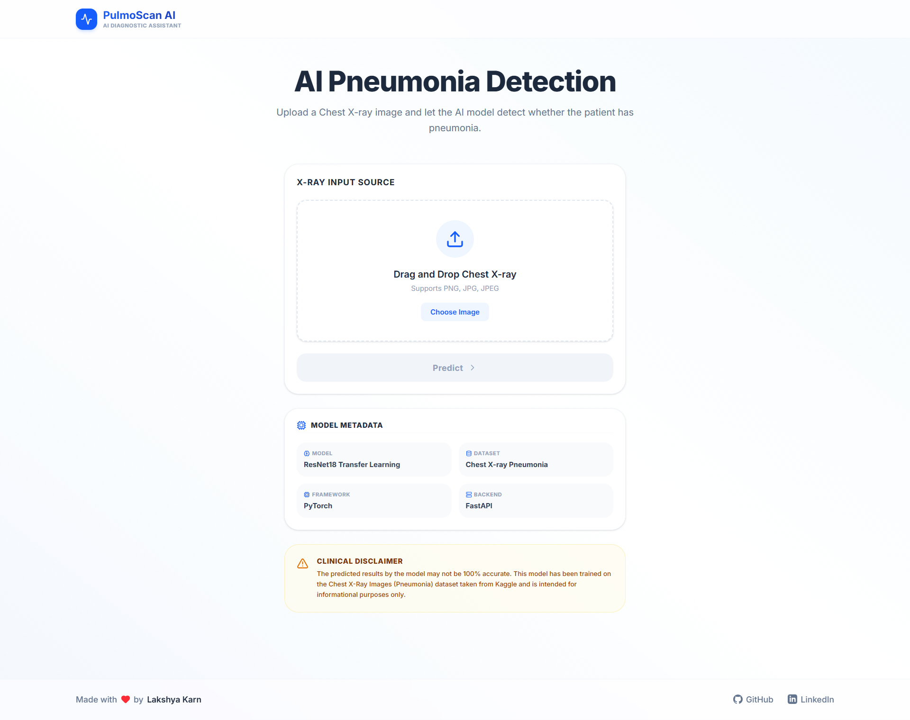
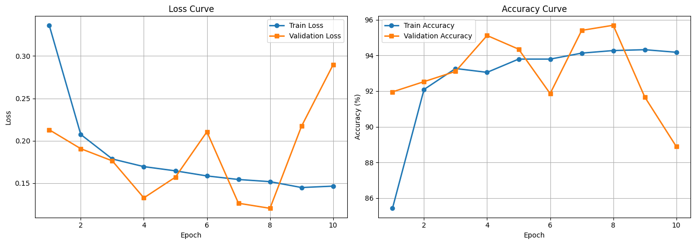
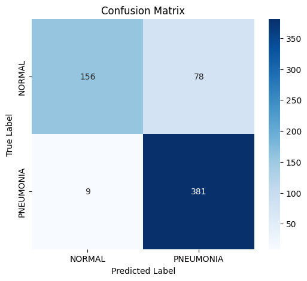

# 🫁 PneumoScan AI

<div align="center">

### AI-Powered Pneumonia Detection from Chest X-ray Images

Detect pneumonia from chest X-ray images using **Deep Learning** with **ResNet18 Transfer Learning**.

Built with **PyTorch**, **FastAPI**, **React**, and **Tailwind CSS**.

[🌐 Live Demo](https://pneumo-scan.lakshyakarn.com.np/) • [🚀 Backend API](https://pneumoscan-ai-backend.onrender.com)

</div>

---

## 📖 Overview

PneumoScan AI is a full-stack deep learning application that detects **Pneumonia** from chest X-ray images. Users can upload an X-ray image through a modern web interface, and the system returns an instant prediction with confidence scores using a pretrained **ResNet18** model fine-tuned with PyTorch.

The project demonstrates the complete machine learning workflow—from data preprocessing and model training to API development, frontend integration, and cloud deployment.

---

# 📸 Application Preview

<p align="center">
    
</p>

---

# ✨ Features

* 🫁 AI-powered Pneumonia Detection
* 🤖 Transfer Learning using ResNet18
* 📤 Drag & Drop Image Upload
* 🖼️ Image Preview before Prediction
* 📊 Prediction Confidence Score
* 📈 Probability Distribution for Both Classes
* ⚡ Fast Inference using FastAPI
* 🎨 Responsive React + Tailwind CSS Frontend
* ☁️ Fully Deployed Frontend & Backend
* 📱 Mobile Friendly Interface

---

# 🏗️ System Architecture

```text
                   User
                     │
                     ▼
         React + Vite Frontend
                     │
          Upload Chest X-ray Image
                     │
                     ▼
          FastAPI Prediction API
                     │
        Image Preprocessing (PIL)
                     │
                     ▼
       ResNet18 Deep Learning Model
                     │
                     ▼
      Softmax Probability Prediction
                     │
                     ▼
     Prediction + Confidence + JSON
                     │
                     ▼
        Display Result on Frontend
```

---

# 🧠 Model Information

| Item              | Details                     |
| ----------------- | --------------------------- |
| Architecture      | ResNet18                    |
| Framework         | PyTorch                     |
| Transfer Learning | ImageNet Pretrained Weights |
| Input Size        | 224 × 224                   |
| Classes           | NORMAL, PNEUMONIA           |
| Optimizer         | Adam                        |
| Loss Function     | CrossEntropyLoss            |

---

# 📂 Dataset

**Dataset:** Chest X-ray Pneumonia Dataset

**Source:** https://www.kaggle.com/datasets/paultimothymooney/chest-xray-pneumonia

Dataset consists of:

* Training Set
* Validation Set
* Test Set

Classification Labels:

* NORMAL
* PNEUMONIA

---

# 📊 Model Performance

## Validation Performance

| Metric              | Score      |
| ------------------- | ---------- |
| Validation Accuracy | **95.69%** |

## Test Performance

| Metric    | Score      |
| --------- | ---------- |
| Accuracy  | **86.06%** |
| Precision | **0.8301** |
| Recall    | **0.9769** |
| F1 Score  | **0.8975** |

The model achieves a **high recall (97.69%)**, making it effective at identifying pneumonia cases while maintaining strong overall classification performance.

---

# 📈 Training Curves

The following plots illustrate the model's learning behavior during training.

* Training loss decreases steadily.
* Validation accuracy reaches **95.69%**.
* The model demonstrates effective learning with good convergence before later epochs begin to overfit.

<p align="center">
    
</p>

---

# 📉 Confusion Matrix

The confusion matrix summarizes the model's classification performance on the test dataset.

<p align="center">
    
</p>

The model correctly identifies the majority of pneumonia cases while maintaining strong overall classification performance.

---

# 🛠️ Tech Stack

## Frontend

* React
* Vite
* Tailwind CSS
* Axios

## Backend

* FastAPI
* PyTorch
* TorchVision
* Pillow
* Uvicorn

---

# 📁 Project Structure

```text
PneumoScan-AI/

│
├── backend/
│   ├── app.py
|   |── pneumonia_classifier.ipynb
│   ├── model.py
│   ├── predict.py
│   ├── utils.py
│   ├── best_resnet18.pth
│   └── requirements.txt
│
├── frontend/
│   ├── src/
│   ├── public/
│   ├── package.json
│   └── vite.config.js
│
├── assets/
│   ├── picture.png
│   ├── curve.png
│   └── cm.png
│
├── README.md
└── .gitignore
```

---

# 🚀 Getting Started

## Clone the Repository

```bash
git clone https://github.com/lakshyakarn10/PneumoScan-AI.git

cd PneumoScan-AI
```

---

## Backend Setup

```bash
cd backend

python -m venv myvenv

# Windows
myvenv\Scripts\activate

# Linux/macOS
source myvenv/bin/activate

pip install -r requirements.txt

uvicorn app:app --reload
```

Backend runs at:

```
http://localhost:8000
```

Interactive API Documentation:

```
http://localhost:8000/docs
```

---

## Frontend Setup

```bash
cd frontend

npm install

npm run dev
```

Frontend runs at:

```
http://localhost:5173
```

---

# 🔌 API Endpoint

## Predict Pneumonia

**POST** `/predict`

Upload a chest X-ray image using `multipart/form-data`.

### Example Response

```json
{
  "prediction": "PNEUMONIA",
  "confidence": 98.42,
  "probabilities": {
    "NORMAL": 1.58,
    "PNEUMONIA": 98.42
  }
}
```

---

# 🌐 Deployment

| Service  | URL                                        |
| -------- | ------------------------------------------ |
| Frontend | https://pneumono-scan.lakshyakarn.com.np/  |
| Backend  | https://pneumoscan-ai-backend.onrender.com |

> **Note:** The backend is hosted on Render's free tier and may take a few seconds to respond after periods of inactivity.

---

# 🚀 Future Improvements

* 🔥 Grad-CAM Explainability
* 🐳 Docker Deployment
* 📄 PDF Medical Report Generation
* 📚 Prediction History
* 👥 User Authentication
* 📦 Batch Image Prediction
* ☁️ Cloud Storage Integration

---

# 👨‍💻 Author

**Lakshya Karn**

* 🎓 B.Tech CSE, NIT Rourkela
* 🐙 GitHub: https://github.com/lakshyakarn10
* 💼 LinkedIn: https://www.linkedin.com/in/lakshya-karn-03332a37b

---


